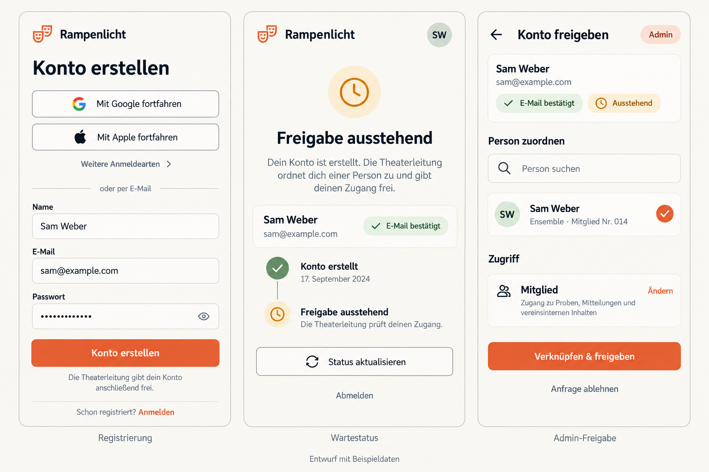
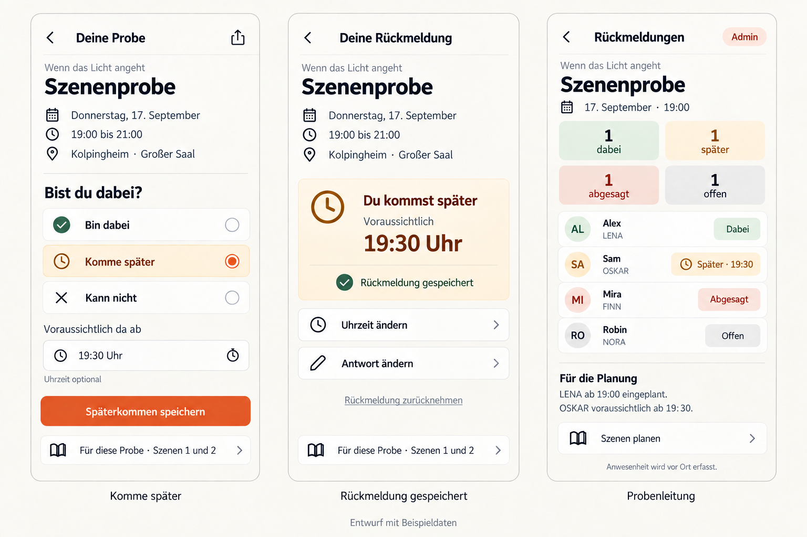
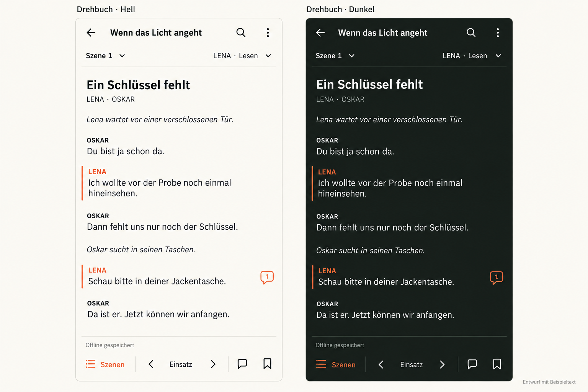
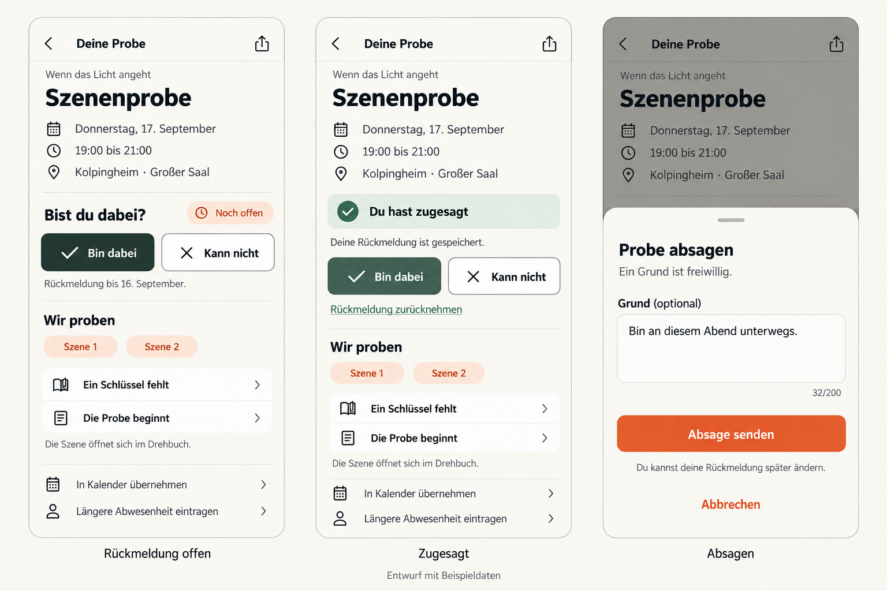
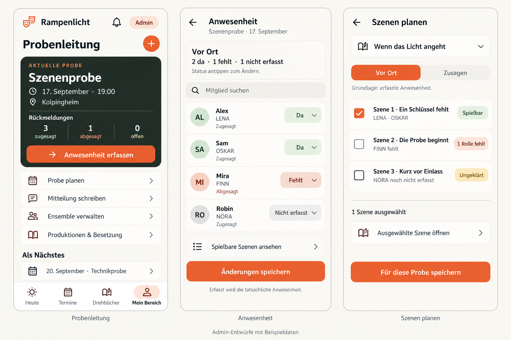
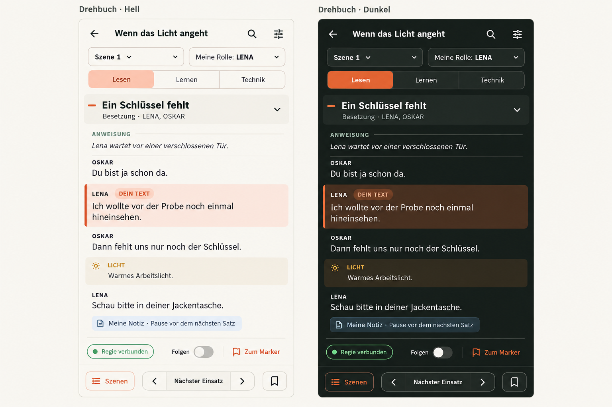
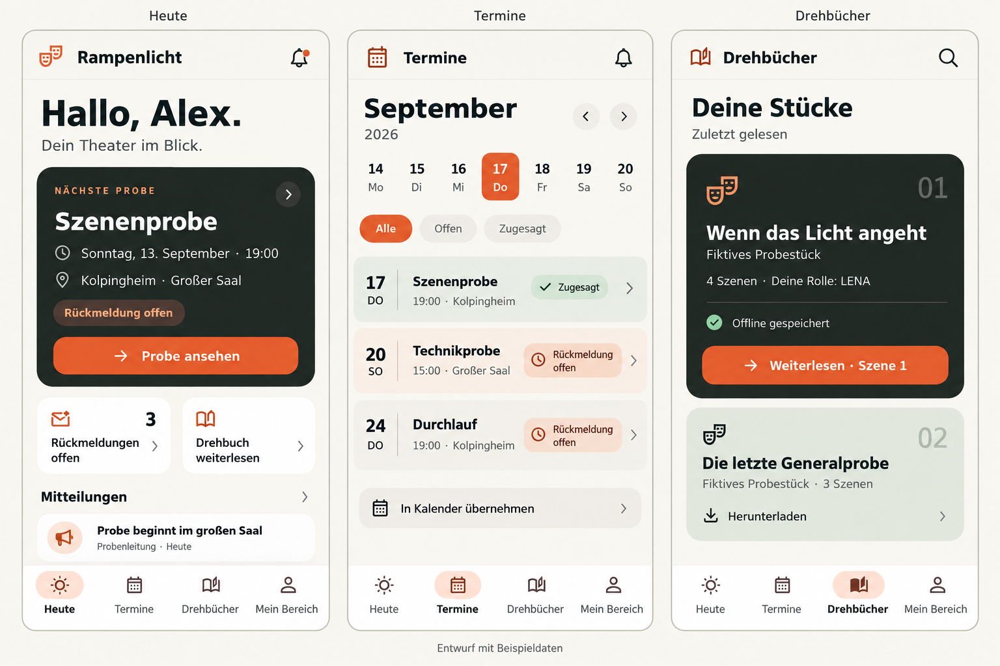
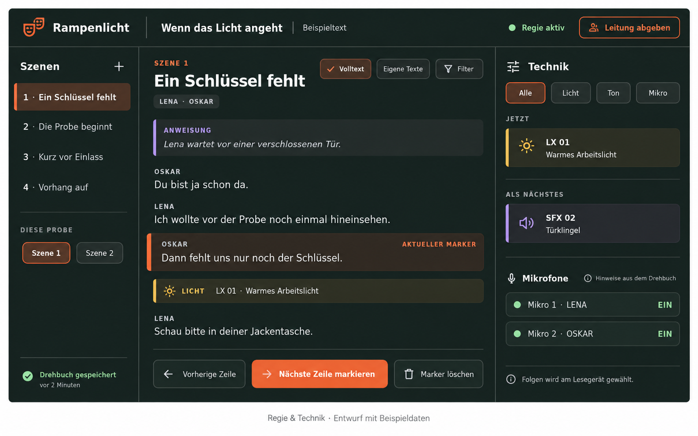

# Designentwürfe

Die Entwürfe behalten die visuelle Richtung des Downloads-Pakets: Creme, dunkles Grün, orange Akzente, kräftige Überschriften und ruhige Flächen. Die aktuelle Leser-Richtung ist Variante 04: fortlaufender Dialog, schlichte kursive Regieanweisungen und wenige Bedienelemente.

Alle Bilder wurden mit dem eingebauten Imagegen-Werkzeug erzeugt. Sie zeigen fiktive Beispielinhalte und geplante Zustände. Registrierung, Freigabe, Notizen, Mitteilungen, neue Verwaltungsansichten und die gemeinsame Regie sind damit noch nicht implementiert. Die vollständigen Prompts stehen in [prompts.json](prompts.json).

## 08: Registrierung und Admin-Freigabe

Der Einstieg bietet E-Mail/Passwort, Google und Apple direkt an. „Weitere Anmeldearten“ öffnet die übrigen eingerichteten Anbieter. Die App bleibt bei kurzen Beschriftungen; Firebase ist eine technische Grundlage und erscheint nicht als Erklärung im Formular.

Nach der Registrierung wartet das Konto auf die Theaterleitung. Dieser Bildschirm hat keine interne App-Navigation. Der Admin wählt eine Person aus dem Ensemble und bestätigt „Verknüpfen & freigeben“. Der Entwurf zeigt eine ausdrücklich gewählte Person, keine automatische Zuordnung aufgrund eines gleichen Namens. Die Kontofreigabe startet mit Mitgliedszugriff.

Die Regeln für Identität, weitere Anmeldearten, Zuordnung, Sperrung und Migration stehen in [Anmeldung und Freigabe](../auth-and-approval.md). Anbieter müssen vor der Nutzung eingerichtet werden.

## 07, überarbeitet: Späterkommen zur festen Probe

Die Probenrückmeldung erhält die dritte Antwort „Komme später“. Die voraussichtliche Ankunft ist optional. Links wird sie bearbeitet, in der Mitte ist die Rückmeldung für denselben festgelegten Termin gespeichert. Uhrzeit, Antwort und Rücknahme bleiben erreichbar.

Die Leitungsübersicht zeigt dabei, später, abgesagt und offen getrennt. Späterkommende erscheinen mit ihrer erwarteten Ankunft, etwa „Später · 19:30“. Diese Angabe hilft bei der Szenenplanung. Tatsächliche Anwesenheit wird weiterhin vor Ort erfasst.

Terminabstimmungen sind aus dem Umfang gestrichen. Der frühere Bildstand 07 ist zurückgezogen und wird hier nicht mehr als Zielansicht gezeigt. Die konkreten Zustands-, Zeit- und Offline-Regeln stehen in [requirements.md](../requirements.md#späterkommen) und im [Flutter-Plan](../flutter-plan.md#datenvertrag-für-späterkommen).

## 04: Minimalistischer Drehbuchleser

Der Stücktext erhält die meiste Fläche. Regieanweisungen stehen kursiv direkt zwischen den Dialogen. Eigene Rollen sind am Rollennamen und einem schmalen Randstrich erkennbar. Wiederholte Kategorien wie „ANWEISUNG“, große eigene-Text-Flächen und die dauerhafte Modusleiste entfallen.

Die aktuelle Rolle und der Lesemodus lassen sich über eine kompakte Auswahl ändern. Technische Details bleiben in der Technikansicht verfügbar. Notizen, Kommentarzugriff und Lesezeichen bleiben erhalten; ein einzelnes Anmerkungssymbol kann auf eine vorhandene Notiz hinweisen. Es gibt keine große Notizkarte im normalen Textfluss.

Der Bookmark-Button bleibt als dezentes Symbol unten rechts erhalten. Die zwischenzeitliche Frage dazu wurde vom Nutzer zurückgenommen; die Funktion wird nicht gestrichen. Sichtbare Icons dürfen klein sein, ihre interaktive Fläche muss beim Flutter-Bau ausreichend groß bleiben.

## 05: Zu- und Absage

Drei ergänzende Zustände derselben Probe: offene Rückmeldung, gespeicherte Zusage und Absage mit freiwilligem Grund. „Komme später“ samt Ankunftszeit ist in Variante 07 gezeigt. Termin und Ort bleiben sichtbar, darunter führt die Szenenauswahl direkt zum passenden Drehbuchabschnitt.

„Bin dabei“ speichert die Zusage direkt. „Kann nicht“ öffnet das kurze Formular mit optionalem Grund. „Abbrechen“ verwirft den Entwurf, und „Rückmeldung zurücknehmen“ setzt die Antwort wieder auf offen. Eine gespeicherte Zusage bedeutet, dass die Serverbestätigung vorliegt. Offline heißt der Zustand stattdessen „Auf diesem Gerät vorgemerkt“; Fehler und abgelaufene Fristen bekommen einen eigenen sichtbaren Zustand.

## 06: Admin-Ansichten

Die Leitung erhält einen Einstieg zu Anwesenheit, Probenplanung, Mitteilungen, Ensemble und Besetzung. Die Anwesenheitsliste erfasst den konkreten Termin mit drei Zuständen: da, fehlt oder nicht erfasst. Die vorherige Rückmeldung einschließlich angekündigtem Späterkommen bleibt als separate Information sichtbar.

Die Szenenplanung kann auf Zusagen oder tatsächlich erfasster Anwesenheit beruhen. Die gewählte Grundlage bleibt sichtbar. In der Beispielansicht sind LENA und OSKAR da, FINN fehlt und NORA wurde noch nicht erfasst. Entsprechend ist Szene 1 spielbar, Szene 2 unvollständig und Szene 3 ungeklärt. Ungeklärte Anwesenheit wird nicht als Absage behandelt.

Das Sample speichert bisher eine vollständige Liste ausgewählter Anwesender. Für die gezeigte Ansicht sind explizite dreiwertige Einträge und der Abgleich einzelner Mitgliedseinträge nötig. Die Bilder allein erweitern diesen Datenvertrag nicht.

## 01: Drehbuch in Hell und Dunkel

Erste Variante zum Vergleich. Die neue Variante 04 reduziert die Anzahl der Leisten, Flächen und Kategorieüberschriften weiter. Die Trennung zwischen Regie-Verbindung und automatischem Folgen bleibt funktional relevant, erscheint aber nur im passenden Sitzungskontext.

Beim Flutter-Bau: Mehrfachrollen unterstützen; den doppelten Pfeil in der generierten Szenenauswahl auf einen reduzieren; Text- und Markerhervorhebung getrennt darstellen. Die Lernansicht verdeckt eigene Zeilen, obwohl hier nur der Lesemodus gezeigt wird.

## 02: Heute, Termine und Drehbücher

Die Struktur bleibt nah am Sample. Der Einstieg führt zur nächsten Probe und zum zuletzt gelesenen Drehbuch. Ein Mitteilungsausschnitt zeigt, wo das noch zu ergänzende Postfach im Alltag auftaucht. Die Produktionsliste bekommt einen direkten Wiedereinstieg statt einer großen Einleitung.

## 03: Regie und Technik auf dem Tablet

Szenen, Text und technische Hinweise stehen nebeneinander. Der markierte Text ist der Bezug für die Regie. Mikrofonzustände sind aus dem Skript abgeleitete Hinweise; sie zeigen keine Verbindung zu echter Audiotechnik. Die gemeinsame Browser-/App-Sitzung muss dafür noch implementiert und getestet werden.

## Referenzen

Die unveränderten Sample-Screenshots liegen unter `reference/rampenlicht/docs/screenshots/`. Die aktuelle Browser-Oberfläche wurde unter [skript.logge.top](https://skript.logge.top/) betrachtet. Ihre Funktionen und Quellen sind in [requirements.md](../requirements.md) dokumentiert.

Bildentwürfe legen weder Pixelmaße noch endgültige Formulierungen fest. Für die Umsetzung gelten die Funktionsanforderungen und echte Flutter-Layoutprüfungen bei verschiedenen Bildschirm- und Schriftgrößen.
